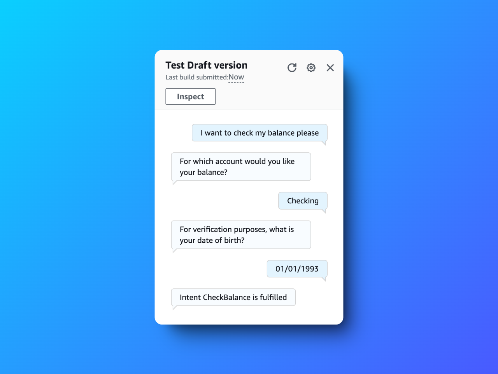
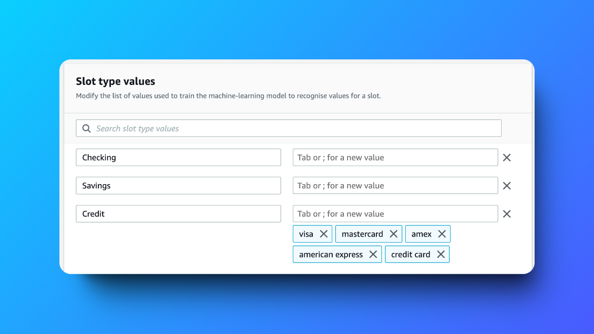
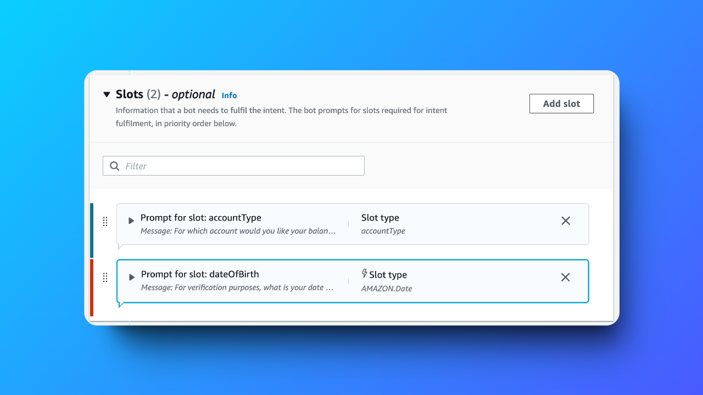
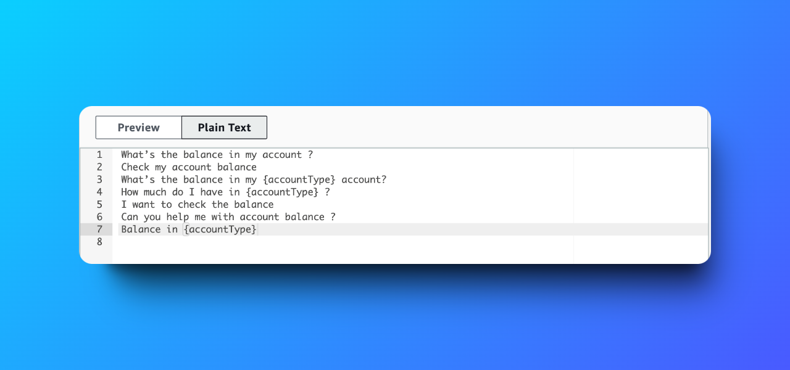

# Build a Chatbot with Amazon Lex: Custom Slots 🤖

---

## 📜 Table of Contents
1. [Project Overview](#project-overview)
2. [What is Amazon Lex?](#what-is-amazon-lex)
3. [Features](#features)
4. [Key Deliverables](#key-deliverables)
5. [Challenges and Lessons Learned](#challenges-and-lessons-learned)
6. [Outcome](#outcome)
7. [Tools and Technologies Used](#tools-and-technologies-used)
8. [Steps to Reproduce](#steps-to-reproduce)
9. [Screenshots](#screenshots)
10. [Acknowledgments](#acknowledgments)
11. [Author](#author)

---

## Project Overview
This project explores **Amazon Lex's** ability to leverage **custom slots** for enhancing conversational AI. By defining unique slot types and integrating them into intents, the chatbot processes dynamic user inputs efficiently. This implementation demonstrates how slots empower bots to deliver tailored interactions, such as personalized banking services.

---

## What is Amazon Lex?
Amazon Lex is a service for building conversational interfaces using voice and text. It simplifies natural language understanding (NLU) and speech recognition to create scalable, intelligent, and interactive chatbots or virtual assistants.

---

## Features
- **Custom Slots**: Capture user-specific data, such as account types, for personalized interactions.
- **Slot Integration with Intents**: Link slots with intents like "CheckBalance" to respond to specific queries dynamically.
- **Utterance Variations**: Enhance recognition accuracy with diverse phrasing.

---

## Key Deliverables
1. **Slot Configuration**:
   - Created custom slots for capturing account types like "savings" or "checking."
   - Restricted slot values to predefined categories for precise input handling.

2. **Intent Association**:
   - Linked custom slots with the "CheckBalance" intent for tailored responses.
   - Embedded slot placeholders in utterances like "What is the balance for my {accountType} account?"

3. **Testing and Fine-Tuning**:
   - Conducted thorough tests to ensure proper recognition and response accuracy.

---

## Challenges and Lessons Learned
### Challenges
- Designing custom slot types with restricted values for controlled user input.
- Handling unrecognized input while maintaining a seamless user experience.

### Lessons Learned
- Custom slots improve chatbot reliability by narrowing user input to predefined values.
- Combining slots with diverse utterances enhances natural language understanding.

---

## Outcome
The project successfully demonstrates how **custom slots** refine chatbot responses, making them precise and context-aware. By integrating slots with intents, the bot provides accurate and dynamic answers to user queries, elevating the overall user experience.

---

## Tools and Technologies Used
- **Amazon Lex**: For conversational AI development.
- **AWS Lambda**: To extend the bot's functionality with serverless compute.
- **Amazon CloudWatch**: For monitoring bot interactions and debugging.

---

## Steps to Reproduce

1. **Set Up a Lex Bot**:
   - Create a new Lex bot and define the initial setup, including intents and utterances.

2. **Create Custom Slots**:
   - Define custom slot types with restricted values like "savings" and "checking."
   - Integrate these slots into relevant intents.

3. **Configure Utterances**:
   - Add slot placeholders in utterances, such as "What is the balance for my {accountType} account?"

4. **Test and Optimize**:
   - Test the bot with varied inputs and refine the slot configurations for maximum accuracy.

---

## Screenshots

### Chatbot Slot Types  

### Chatbot Slots  

### Example Utterances

---

## Acknowledgments
Special thanks to **NextWork.org** for providing valuable resources and guidance on AWS technologies. Their support helped bring this project to fruition.

---

## Author
**Hassan Gachoka**  

